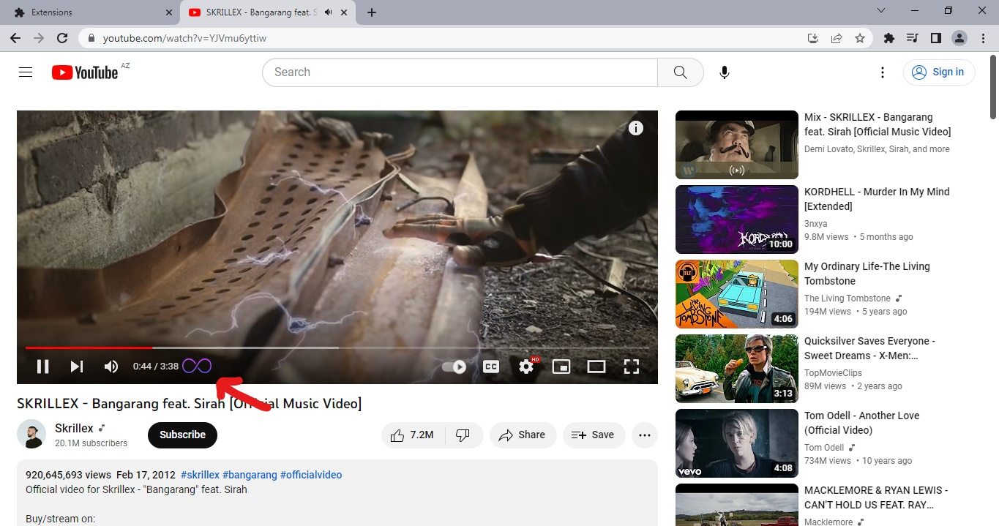

# YouTube Video Loop Extension

This browser extension provides a continuous playback experience by automatically looping your favorite music and videos on YouTube. The extension restarts the videos immediately after they end, eliminating the need for users to manually restart them, thus allowing for uninterrupted playback.

## Usage

1. Open the extension management in your Google Chrome browser.
2. Enable "Developer mode".
3. Click on "Load unpacked" and select the directory where your extension's source code is located.
4. Go to YouTube and open a video.
5. "Click the loop icon to continuously play the video."

